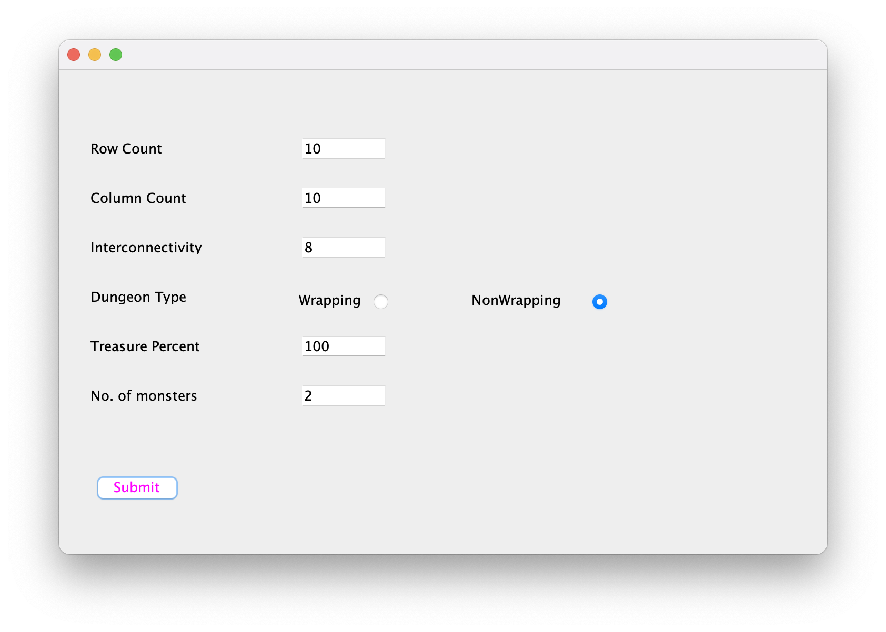
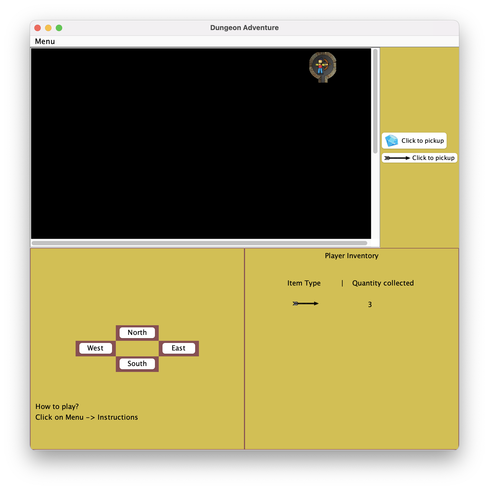
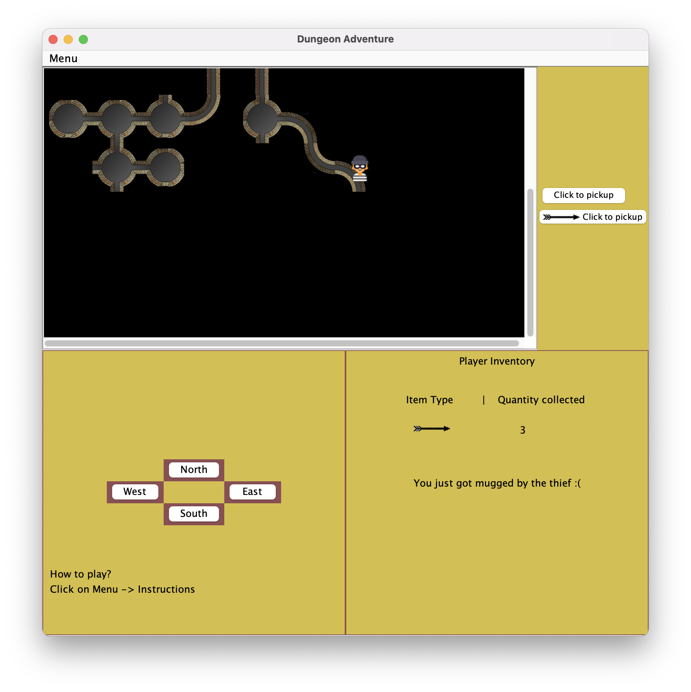
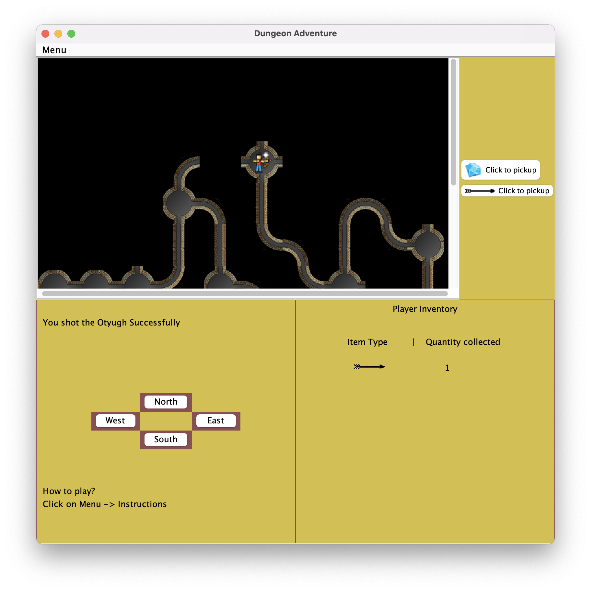
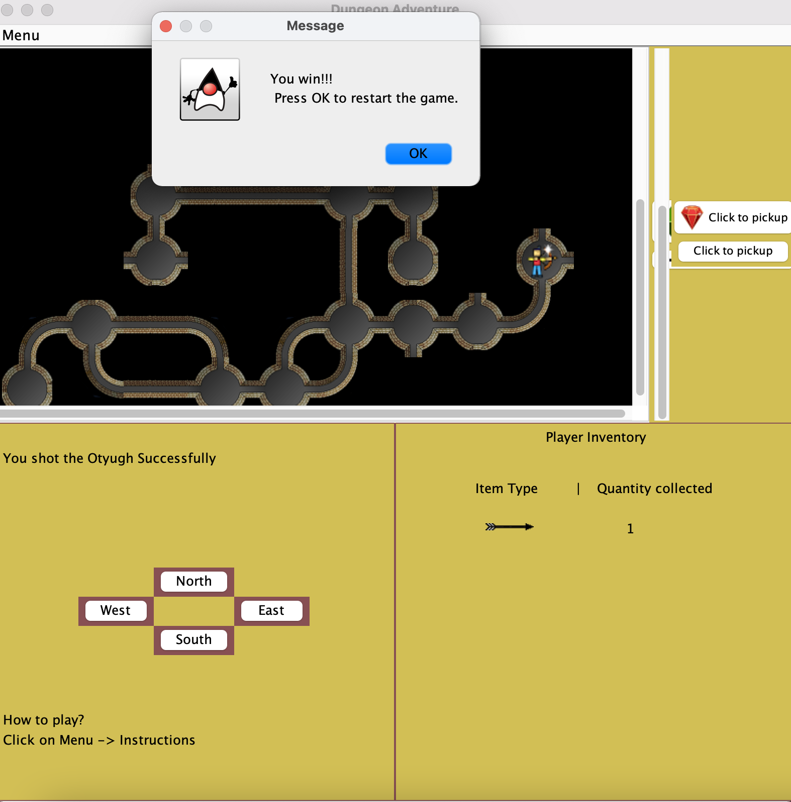

# PROJECT 5 : Graphical Adventure Game

## Overview

The world of our game consists of dungeons, interconnected tunnels and networks
of caves, allowing players to explore the world and travel from cave to cave
through tunnels that connect caves. Additionally, we also have monsters called
as Otyughs in our dungeon this time. At every point in time, the player can
decide which direction to move in given that there exists a path in that
direction. Goal of the player is to either reach to a certain end goal location
or to explore all the caves in the dungeon while collecting treasures and arrows
placed inside every cave and killing Otyughs along the way by sensing their
presence by their smell. So far we had created the model and the controller for
the Text-based adventure game, now we shall be creating the View for our game
and create a separate Graphical controller which will relay information and
execute tasks back and forth between the model and the view. This is a
full-fledged MVC application that we shall be creating in this project.

We shall implement a Java program that caters to the needs of the problem
statement and provides with a robust solution.

## List of Features

### General Features:

The dungeon should be rendered as a 2D grid. There must be a path from every
cave in the dungeon to every other cave in the dungeon. Each dungeon can be
built with some degree of interconnection. We define the interconnectivity = 0
when there is exactly one path from every cave in a dungeon to every other cave
in the dungeon. Increasing the degree of connection increases the number of
paths between caves. Not all dungeons "cross" from one side to the other (as
defined above). One cave is randomly chosen as the start and one cave is
randomly selected as the end. The path length between the start and end
positions must be at least 5.

### Functionalities Provided by our code:

#### Console Game :

- Functionality to create both wrapping and non wrapping dungeons.
- Functionality add any three types of treasure : RUBY, DIAMOND, SAPPHIRE
- Treasure is added to at least 20% of the caves in the dungeon.
- Functionality to move the player around in the dungeon.
- Functionality to describe the player's current location and treasure
  collected.
- Ability to move the player from the start position to the end position based
  on the user's keyboard input.
- Ability to randomly select start and end nodes.
- It facilitates interactive player movement by printing information that helps
  move the player in the right direction.
- Determining the direction of each cave and tunnel to the adjacent location of
  E / W / N / S.
- Displays the player description of the treasure collected by the player. A
  description of the player's location at the current location, a treasure in
  the room and a description of the player's possible moves from this room
  (north, east, south, west).
- Display and prints recommended paths for users to know which path leads the
  player to their final destination.
- Ability for players to explore all the nodes in the dungeon.
- Ability to add Otyugh (smell monster) to the dungeon. Players can feel the
  smell. Strong if Otyugh is away from the cave, weaker if Otyugh is two
  positions away, or if two Otyugh are one position away from the player.
- The player can shoot an arrow in the direction and distance specified by the
  user, hitting it once will hurt the Otyugh, and hitting the same Otyugh twice
  will kill it.
- Players can pick up arrows hidden in caves and tunnels.

#### Graphical Game :

- We give the user the control to configure the dungeon by providing a
  configuration view where the user can set the dungeon parameters and hit the
  submit button.
- Upon hitting the submit button, the dungeon model will be created and and a
  view is displayed to the user.
- The game view has a menu bar that exposes the game settings.
- User can Restart a game, create a new game, and quit the game from Menubar.
- The game begins with a black screen with only the start cave visible. The rest
  of the dungeon reveals part by part as the player explores and travels inside
  the dungeon.
- You can move the player in one of the ways which is either by clicking on the
  dungeon locations on the screen directly, or using the arrow keys on the
  keyboard, or you also have the additional functionality of moving player
  through the on-screen buttons which imitate a joystick.
- We have a location description panel that shows the treasure or arrows present
  inside the location on the upper right panel.
- You can press 'T' to pick up treasure and 'A' to pick up arrows.
- You also have the functionality to see the real time description of the
  player's inventory, where you can see what items the player has collected so
  far.
- You can shoot an Otyugh by holding the Shift key and along with that pressing
  the arrow to key of the direction in which you wish to shoot.
- You can also see the smell description on the screen, whether it is a strong
  smell or weak smell, also you see the stench on the screen inside dungeon.

## How to RUN

* Find the JAR file for the project in the res/ folder.
* Navigate to the res/ folder using CMD(windows) or terminal(linux/mac).
* If you want to play the text based game then pass the command line 
  arguments as explained below:
* Run java –jar DungeonViewProject05.jar 'rowCount' 'columnCount' 
  'interconnectivity'
  <'dungeonType': WRAPPING for wrapping dungeon and NON_WRAPPING for
  non-wrapping dungeon> 'treasurePercent''otyughCount'.
* Example: java –jar DungeonViewProject05.jar 4 5 4 NON_WRAPPING 100 3
* Example: java –jar DungeonViewProject05.jar 3 7 4 WRAPPING 50 5
* If you want to play the Graphical game, no need to pass in the Command 
  line arguments. Just execute the command: java –jar DungeonViewProject05.jar

## How to use the Program

* Run the Driver file that has the main method.
* If you choose to play the text based game then:
 1. This will invoke the DungeonConsoleController class and the controller will
  start your text based adventure game.
 2. From here on, you just have to carefully read the on screen instructions and
  follow along to enjoy playing the game.
 3. The program or the game stops when you press Q or when you are eaten by the
  monster.
* If you choose to play the graphical game, then the Graphical controller 
  will be created and settings view will be shown. Here on just enter the 
  values and start playing the game by looking at the view.

You can also locate the Driver file named Driver.java and run that file to
execute the program.

## Description of Example

### Graphical Game Example Screen Shots:

1. The above image shows the Configurations view, where the user can set all 
   the dungeon model settings and start the game. You need to pass in all 
   the values in the given text fields otherwise it will show an error popup 
   message. 

2. The above image shows the initial start state of the game. This is how 
   the game looks as soon as it begins. You only see the player's start 
   location and rest of the dungeon is entirely black.
   You can click on the treasure and arrow buttons on the right to pick them 
   up or press 'T' or 'A' on the keyboard alternatively.

3. The above image shows a thief inside the dungeon. And you can also see 
   the message that the thief has mugged the player.

4. When you shoot the Otyugh you see the message saying " You shot the 
   Otyugh successfully." Also, the player's image changes and a spark is 
   added to the player's image indicating that the arrow successfully hit 
   the Otyugh.

5. When the player reaches the end cave by killing the Otyugh in the end 
   cave, The win message pops up as shown in the image above and after the 
   user click OK, the game restarts.

6. When the player enters inside the cave in which a healthy Otyugh is 
   present, the Otyugh kills and eats the player. The popup message of 
   "Chomp Chomp Chomp" displays on screen which indicates that the game is over!
   At this point you can start a new game again or quit.

### Console Game Example Run Description:
1. Refer the text file named "ExampleRun1_Wrapping.txt" attached to see the
   output of the entire run of the program. That run is explained here below:

* Prints the current location of the player. This is the start location.
* Displays the treasures and arrows in the location.
* Asks if you want to pick up the treasure. The user presses Y to pickup.
* Asks if you want to pick up the arrows. The user presses Y to pickup.
* Displays how many arrows and what treasures the player picked up.
* Detects smell, and displays what type of smell is detected.
* Asks the user if he wants to shoot the Otyugh.
* User chooses to shoot. Then he us asked the direction in which he wants to
  shoot. The user specifies East and a distance of 2. Unfortunately, the user
  missed the shot.
* Now there is a prompt that shows the possible move from the current location.
  User chooses to move to West.
* Again the description of the new current location is printed. So this cycle
  keeps on repeating everytime a player reaches a new location.
* When the player successfully shoots an Otyugh, a message is printed saying:
  "An Otyugh at location: '<x>' was shot but not killed. Previous Health was:
  100 && Current Health is: 50"
* When a player successfully kills an Otyugh, a message is printed saying:
  "An Otyugh at location: <x> was killed. Previous Health was: 50 && Current
  Health is: 0"
* When the player enters a cave with a fully healthy monster, he is eaten by the
  monster. Or when the player enters a room with monster who is injured, the
  player has a 50% chance of dying.
* When a player dies the following message is printed as shown in this example
  run:
  "Chomp chomp chomp, You have been eaten by the Otyugh Game Over"

2. The file ExampleRun2_NW.txt shows the similar flow of game. The only
   difference is that it uses a NON_WRAPPING dungeon in the game. The player
   reaches the end location in this run and the following message is printed:
   "Yay! You won. Do you still wish to roam around? Enter Y to roam, else press
   any other key Q Game Over"

## Design Model Changes

- Included a method to add thieves inside the dungeon. In my dungeon, only 2 
  thieves are added no matter the size of the dungeon.
- Included a method to set the neighbours of the locations in the form of 
  string.

Other than that, overall structure of the Design is same as before. Some
additional methods were added and some redundant methods were removed and
discarded from the design. As suggested by the instructor, the visibility of
some variables and methods were changed to appropriate access modifiers.

## Assumptions

### Console Game Assumptions:
* Treasure percentage provided by the user is taken as the upper bound to set
  the treasure in caves.
* The prompt to pickup treasures will only be shown if there is treasure
  available in the location to pickup.
* The prompt to pickup arrows will only be shown if there are arrows available
  in the location to pickup.
* The prompt to shoot an arrow will only be shown if the player is able to
  detect some smell, not otherwise.
* Player is not given an opportunity to shoot again if he misses the shot. So if
  he wants to shoot again, he will first have to move to some other location and
  then shoot again from there, or com back after moving to other location and
  then shoot. It is just my design choice.

### Graphical Game Assumptions:
* The Player is given an opportunity to shoot unlimited number of times even 
  when he misses the shot, until the player has arrows left. (Unlike console 
  game).
* There will always only to 2 thieves in the dungeon, no matter the size of 
  the dungeon.
* The thief will loot the all the treasure from the player.

## Limitations

* Player is not given the opportunity to pick partial treasures, it will either
  pick all treasures or none.
* Player is not given the opportunity to pick partial arrows, it will either
  pick all arrows or none.

## Citations

No citations.
